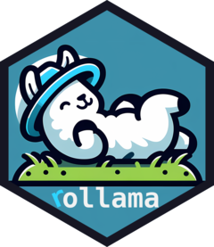

<!-- README.md is generated from README.Rmd. Please edit that file -->

```{r, include = FALSE}
knitr::opts_chunk$set(
    collapse = TRUE,
  comment = "#>",
  fig.path = "man/figures/README-",
  out.width = "100%"
)
```

# `rollama` 

<!-- badges: start -->
[](https://github.com/JBGruber/rollama/actions/workflows/R-CMD-check.yaml)
[](https://app.codecov.io/gh/JBGruber/rollama?branch=main)
[](https://CRAN.R-project.org/package=rollama)
[](https://cran.r-project.org/package=rollama)
[](https://doi.org/10.48550/arXiv.2404.07654)
[](https://saythanks.io/to/JBGruber)
<!-- badges: end -->

The goal of `rollama` is to wrap the Ollama API, which allows you to run different LLMs locally and create an experience similar to ChatGPT/OpenAI's API.
Ollama is very easy to deploy and handles a huge number of models.
Checkout the project here: <https://github.com/ollama/ollama>.


## Installation

You can install this package from CRAN:

``` r
install.packages("rollama")
```

Or you can install the development version  of `rollama` from [GitHub](https://github.com/JBGruber/rollama). This version is updated more frequently and may contain bug fixes (or new bugs):

``` r
# install.packages("remotes")
remotes::install_github("JBGruber/rollama")
```

However, `rollama` is just the client package.
The models are run in `Ollama`, which you need to install on your system, on a remote system or through [Docker](https://docs.docker.com/desktop/).
The easiest way is to simply download and install the Ollama application from [their website](https://ollama.com/).
Once `Ollama` is running, you can see if you can access it with:

```{r}
rollama::ping_ollama()
```


### Installation of Ollama through Docker

For beginners we recommend to download Ollama from [their website](https://ollama.com/). However, if you are familiar with Docker, you can also run Ollama through Docker. The advantage of running things through Docker is that the application is isolated from the rest of your system, behaves the same on different systems, and is easy to download and update.
You can also get a nice web interface.
After making sure  [Docker](https://docs.docker.com/desktop/) is installed, you can simply use the Docker Compose file from [this gist](https://gist.github.com/JBGruber/73f9f49f833c6171b8607b976abc0ddc).

If you don’t know how to use Docker Compose, you can follow this [video](https://www.youtube.com/watch?v=iMyCdd5nP5U) to use the compose file and start Ollama and Open WebUI.

## Example

The first thing you should do after installation is to pull one of the models from <https://ollama.com/library>.
By calling `pull_model()` without arguments, you are pulling the (current) default model  --- "llama3.1 8b":

```{r lib}
library(rollama)
```
```{r eval=FALSE}
pull_model()
```

There are two ways to communicate with the Ollama API.
You can make single requests, which does not store any history and treats each query as the beginning of a new chat:

```{r query}
# ask a single question
query("Why is the sky blue? Answer with one sentence.")
```

With the output argument, we can specify the format of the response. Available options include "text", "list", "data.frame", "response", "httr2_response", and "httr2_request":

```{r output}
# ask a single question and specify the output format
query("Why is the sky blue? Answer with one sentence." , output = "text")
```

Or you can use the `chat` function, treats all messages sent during an R session as part of the same conversation:

```{r chat}
# hold a conversation
chat("Why is the sky blue? Give a short answer.")
chat("And how do you know that? Give a short answer.")
```

If you are done with a conversation and want to start a new one, you can do that like so:

```{r new}
new_chat()
```

## Model parameters

You can set a number of model parameters, either by creating a new model, with a [modelfile](https://jbgruber.github.io/rollama/reference/create_model.html), or by including the parameters in the prompt:

```{r}
query("Why is the sky blue? Answer with one sentence.", output = "text",
      model_params = list(
        seed = 42,
        num_gpu = 0)
      )
```

```{r include=FALSE, results='asis'}
l <- readLines("https://raw.githubusercontent.com/ollama/ollama/main/docs/modelfile.md")
s <- grep("#### Valid Parameters and Values", l, fixed = TRUE)
e <- grep("### TEMPLATE", l, fixed = TRUE)
cat(l[s:e - 1], sep = "\n")
```


## Configuration

You can configure the server address, the system prompt and the model used for a query or chat.
If not configured otherwise, `rollama` assumes you are using the default port (11434) of a local instance ("localhost").
Let's make this explicit by setting the option:

```{r server}
options(rollama_server = "http://localhost:11434")
```

You can change how a model answers by setting a configuration or system message in plain English (or another language supported by the model):

```{r config}
options(rollama_config = "You make short answers understandable to a 5 year old")
query("Why is the sky blue?")
```

By default, the package uses the "llama3.1 8B" model. Supported models can be found at <https://ollama.com/library>.
To download a specific model make use of the additional information available in "Tags" <https://ollama.com/library/llama3.2/tags>.
Change this via `rollama_model`:

```{r model}
options(rollama_model = "llama3.2:3b-instruct-q4_1")
# if you don't have the model yet: pull_model("llama3.2:3b-instruct-q4_1")
query("Why is the sky blue? Answer with one sentence.")
```

## Easy query generation

The `make_query` function simplifies the creation of structured queries, which can, for example, be used in [annotation tasks](https://jbgruber.github.io/rollama/articles/annotation.html#the-make_query-helper-function).

Main components (check the [documentation](https://jbgruber.github.io/rollama/articles/annotation.html#the-make_query-helper-function) for more options):

- **`text`**: The text(s) to classify.
- **`prompt`**: Could be a (classification) question
- **`system`**: Optional system prompt providing context or instructions for the task.
- **`examples`**: Optional prior examples for one-shot or few-shot learning (user messages and assistant responses).


**Zero-shot Example**  
In this example, the function is used without examples:

```{r make_query}
# Create a query using make_query
q_zs <- make_query(
  text = "the pizza tastes terrible",
  prompt = "Is this text: 'positive', 'neutral', or 'negative'?",
  system = "You assign texts into categories. Answer with just the correct category."
)
# Print the query
print(q_zs)
# Run the query
query(q_zs, output = "text")

```

## Learn more

- [Use rollama for annotation tasks](https://jbgruber.github.io/rollama/articles/annotation.html)
- [Annotate images](https://jbgruber.github.io/rollama/articles/image-annotation.html)
- [Get text embedding](https://jbgruber.github.io/rollama/articles/text-embedding.html)
- [Use more models (GGUF format) from Hugging Face](https://jbgruber.github.io/rollama/articles/hf-gguf.html)


## Citation

Please cite the package using the [pre print](https://arxiv.org/abs/2404.07654) DOI:  <https://doi.org/10.48550/arXiv.2404.07654> 


