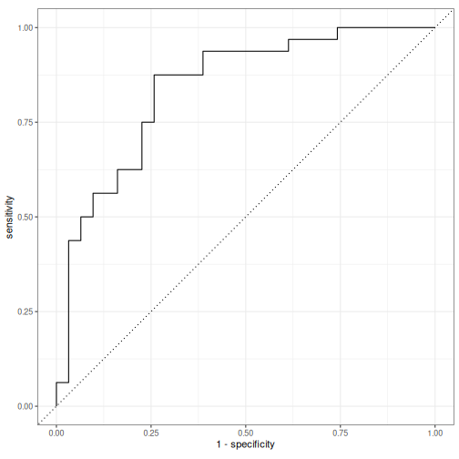

Ollama, and hence `rollama`, can be used for text embedding.
In short, text embedding uses the knowledge of the meaning of words inferred from the context that is saved in a large language model through its training to turn text into meaningful vectors of numbers.
This technique is a powerful preprocessing step for supervised machine learning and often increases the performance of a classification model substantially.
Compared to using `rollama` directly for classification, the advantage is that converting text into embeddings and then using these embeddings for classification is usually faster and more resource efficient -- especially if you re-use embeddings for multiple tasks.


```r
library(rollama)
library(tidyverse)
```


```r
reviews_df <- read_csv("https://raw.githubusercontent.com/AFAgarap/ecommerce-reviews-analysis/master/Womens%20Clothing%20E-Commerce%20Reviews.csv",
                       show_col_types = FALSE)
glimpse(reviews_df)
#> Rows: 23,486
#> Columns: 11
#> $ ...1                      [3m[38;5;246m<dbl>[39m[23m 0, 1, 2, 3, 4, 5, 6, 7, 8, 9, 1…
#> $ `Clothing ID`             [3m[38;5;246m<dbl>[39m[23m 767, 1080, 1077, 1049, 847, 108…
#> $ Age                       [3m[38;5;246m<dbl>[39m[23m 33, 34, 60, 50, 47, 49, 39, 39,…
#> $ Title                     [3m[38;5;246m<chr>[39m[23m NA, NA, "Some major design flaw…
#> $ `Review Text`             [3m[38;5;246m<chr>[39m[23m "Absolutely wonderful - silky a…
#> $ Rating                    [3m[38;5;246m<dbl>[39m[23m 4, 5, 3, 5, 5, 2, 5, 4, 5, 5, 3…
#> $ `Recommended IND`         [3m[38;5;246m<dbl>[39m[23m 1, 1, 0, 1, 1, 0, 1, 1, 1, 1, 0…
#> $ `Positive Feedback Count` [3m[38;5;246m<dbl>[39m[23m 0, 4, 0, 0, 6, 4, 1, 4, 0, 0, 1…
#> $ `Division Name`           [3m[38;5;246m<chr>[39m[23m "Initmates", "General", "Genera…
#> $ `Department Name`         [3m[38;5;246m<chr>[39m[23m "Intimate", "Dresses", "Dresses…
#> $ `Class Name`              [3m[38;5;246m<chr>[39m[23m "Intimates", "Dresses", "Dresse…
```

Now this is a rather big dataset, and I don't want to stress my GPU too much, so I only select the first 250 reviews for embedding.
I also process the data slightly by combining the title and review text into a single column and turning the rating into a binary variable:


```r
reviews <- reviews_df |>
  slice_head(n = 250) |> 
  rename(id = ...1) |>
  mutate(rating = factor(Rating == 5, c(TRUE, FALSE), c("5", "<5"))) |> 
  mutate(full_text = paste0(ifelse(is.na(Title), "", Title), `Review Text`))
```

To turn one or multiple texts into embeddings, you can simply use `embed_text`:


```r
embed_text(text = reviews$full_text[1:3])
#> ✔ embedded 3 texts [4s] 
#> # A tibble: 3 × 4,096
#>   dim_1  dim_2 dim_3  dim_4 dim_5  dim_6  dim_7  dim_8 dim_9 dim_10
#>   <dbl>  <dbl> <dbl>  <dbl> <dbl>  <dbl>  <dbl>  <dbl> <dbl>  <dbl>
#> 1  1.85 -1.71   1.47  0.478 -1.75  0.771  3.01   0.961 1.65   0.569
#> 2  1.14 -3.61   2.10 -0.385 -4.11 -3.09   0.990 -1.06  2.55   1.84 
#> 3 -3.35  0.172 -3.49 -0.569 -3.14  1.25  -0.102  1.15  0.575 -2.33 
#> # ℹ 4,086 more variables: dim_11 <dbl>, dim_12 <dbl>,
#> #   dim_13 <dbl>, dim_14 <dbl>, dim_15 <dbl>, dim_16 <dbl>,
#> #   dim_17 <dbl>, dim_18 <dbl>, dim_19 <dbl>, dim_20 <dbl>,
#> #   dim_21 <dbl>, dim_22 <dbl>, dim_23 <dbl>, dim_24 <dbl>,
#> #   dim_25 <dbl>, dim_26 <dbl>, dim_27 <dbl>, dim_28 <dbl>,
#> #   dim_29 <dbl>, dim_30 <dbl>, dim_31 <dbl>, dim_32 <dbl>,
#> #   dim_33 <dbl>, dim_34 <dbl>, dim_35 <dbl>, dim_36 <dbl>, …
```

To use this on the sample of reviews, I put the embeddings into a new column, before unnesting the resulting data.frame.
The reason behind this is that I want to make sure the embeddings belong to the correct review ID:


```r
reviews_embeddings <- reviews |> 
  mutate(embeddings = embed_text(text = full_text)) |> 
  select(id, rating, embeddings) |> 
  unnest_wider(embeddings)
#> ✔ embedded 250 texts [1m 57.8s]       
```

The resulting data.frame contains the ID and rating along the 4,096 embedding dimensions:


```r
reviews_embeddings
#> # A tibble: 250 × 4,098
#>       id rating  dim_1  dim_2  dim_3  dim_4 dim_5  dim_6  dim_7
#>    <dbl> <fct>   <dbl>  <dbl>  <dbl>  <dbl> <dbl>  <dbl>  <dbl>
#>  1     0 <5      1.85  -1.71   1.47   0.478 -1.75  0.771  3.01 
#>  2     1 5       1.14  -3.61   2.10  -0.385 -4.11 -3.09   0.990
#>  3     2 <5     -3.35   0.172 -3.49  -0.569 -3.14  1.25  -0.102
#>  4     3 5       2.41  -3.97  -1.27  -0.839 -4.06 -2.64   0.672
#>  5     4 5      -0.144 -1.98   0.367 -0.908 -2.29 -0.805 -0.921
#>  6     5 <5     -0.975 -1.47   0.441 -1.90  -3.05 -1.53  -0.941
#>  7     6 5       1.35  -0.397  0.874  0.643 -1.26 -2.45   0.659
#>  8     7 <5      1.63  -2.00  -0.619 -0.981 -3.44 -1.80   0.440
#>  9     8 5      -1.33  -2.35   0.671 -1.46  -3.16 -1.44  -0.880
#> 10     9 5       1.39  -2.13   1.36  -0.702 -4.00 -1.37   0.979
#> # ℹ 240 more rows
#> # ℹ 4,089 more variables: dim_8 <dbl>, dim_9 <dbl>, dim_10 <dbl>,
#> #   dim_11 <dbl>, dim_12 <dbl>, dim_13 <dbl>, dim_14 <dbl>,
#> #   dim_15 <dbl>, dim_16 <dbl>, dim_17 <dbl>, dim_18 <dbl>,
#> #   dim_19 <dbl>, dim_20 <dbl>, dim_21 <dbl>, dim_22 <dbl>,
#> #   dim_23 <dbl>, dim_24 <dbl>, dim_25 <dbl>, dim_26 <dbl>,
#> #   dim_27 <dbl>, dim_28 <dbl>, dim_29 <dbl>, dim_30 <dbl>, …
```


As said above, these embeddings are often used in supervised machine learning.
I use part of [a blog post by Emil Hvitfeldt](https://emilhvitfeldt.com/post/textrecipes-series-pretrained-word-embeddings/) show how this can be done using the data we embedded above in the powerful `tidymodels` collection of packages:


```r
library(tidymodels)
# split data into training an test set (for validation)
set.seed(1)
reviews_split <- initial_split(reviews_embeddings)

reviews_train <- training(reviews_split)

# set up the model we want to use 
lasso_spec <- logistic_reg(penalty = tune(), mixture = 1) |>
  set_engine("glmnet")

# we specify that we want to do some hyperparameter tuning and bootstrapping
param_grid <- grid_regular(penalty(), levels = 50)
reviews_boot <- bootstraps(reviews_train, times = 10)

# and we define the model. Here we use the embeddings to predict the rating
rec_spec <- recipe(rating ~ ., data = select(reviews_train, -id))

# bringing this together in a workflow
wf_fh <- workflow() |>
  add_recipe(rec_spec) |>
  add_model(lasso_spec)

# now we do the tuning
set.seed(42)
lasso_grid <- tune_grid(
  wf_fh,
  resamples = reviews_boot,
  grid = param_grid
) 

# select the best model
wf_fh_final <- wf_fh |>
  finalize_workflow(parameters = select_best(lasso_grid, "roc_auc"))

# and train a new model + predict the classes for the test set
final_res <- last_fit(wf_fh_final, reviews_split)

# we extract these predictions
final_pred <- final_res |>
  collect_predictions()

# and evaluate them with a few standard metrics
my_metrics <- metric_set(accuracy, precision, recall, f_meas)

my_metrics(final_pred, truth = rating, estimate = .pred_class)
#> # A tibble: 4 × 3
#>   .metric   .estimator .estimate
#>   <chr>     <chr>          <dbl>
#> 1 accuracy  binary         0.778
#> 2 precision binary         0.765
#> 3 recall    binary         0.812
#> 4 f_meas    binary         0.788

# and the ROC curve
final_pred |> 
  roc_curve(rating, .pred_5) |> 
  autoplot()
```



