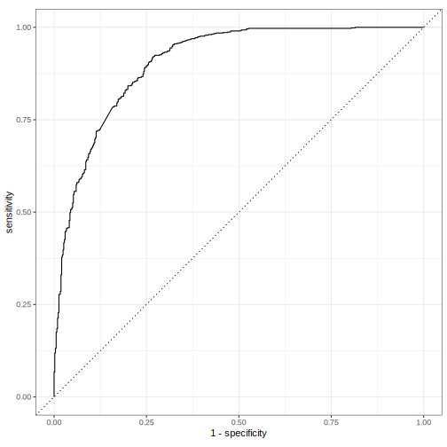

Ollama, and hence `rollama`, can be used for text embedding.
In short, text embedding uses the knowledge of the meaning of words inferred from the context that is saved in a large language model through its training to turn text into meaningful vectors of numbers.
This technique is a powerful preprocessing step for supervised machine learning and often increases the performance of a classification model substantially.
Compared to using `rollama` directly for classification, the advantage is that converting text into embeddings and then using these embeddings for classification is usually faster and more resource efficient -- especially if you re-use embeddings for multiple tasks.


``` r
library(rollama)
library(tidyverse)
```


``` r
reviews_df <- read_csv("https://raw.githubusercontent.com/AFAgarap/ecommerce-reviews-analysis/master/Womens%20Clothing%20E-Commerce%20Reviews.csv",
                       show_col_types = FALSE)
glimpse(reviews_df)
#> Rows: 23,486
#> Columns: 11
#> $ ...1                      <dbl> 0, 1, 2, 3, 4, 5, 6, 7, 8, 9, 10, …
#> $ `Clothing ID`             <dbl> 767, 1080, 1077, 1049, 847, 1080, …
#> $ Age                       <dbl> 33, 34, 60, 50, 47, 49, 39, 39, 24…
#> $ Title                     <chr> NA, NA, "Some major design flaws",…
#> $ `Review Text`             <chr> "Absolutely wonderful - silky and …
#> $ Rating                    <dbl> 4, 5, 3, 5, 5, 2, 5, 4, 5, 5, 3, 5…
#> $ `Recommended IND`         <dbl> 1, 1, 0, 1, 1, 0, 1, 1, 1, 1, 0, 1…
#> $ `Positive Feedback Count` <dbl> 0, 4, 0, 0, 6, 4, 1, 4, 0, 0, 14, …
#> $ `Division Name`           <chr> "Initmates", "General", "General",…
#> $ `Department Name`         <chr> "Intimate", "Dresses", "Dresses", …
#> $ `Class Name`              <chr> "Intimates", "Dresses", "Dresses",…
```

Now this is a rather big dataset, and I don't want to stress my GPU too much, so I only select the first 5,000 reviews for embedding.
I also process the data slightly by combining the title and review text into a single column and turning the rating into a binary variable:


``` r
reviews <- reviews_df |>
  slice_head(n = 5000) |>
  rename(id = ...1) |>
  mutate(rating = factor(Rating == 5, c(TRUE, FALSE), c("5", "<5"))) |>
  mutate(full_text = paste0(ifelse(is.na(Title), "", Title), `Review Text`))
```

To turn one or multiple texts into embeddings, you can simply use `embed_text`:


``` r
embed_text(text = reviews$full_text[1:3])
#> # A tibble: 3 × 3,072
#>   dim_1 dim_2  dim_3    dim_4  dim_5  dim_6  dim_7  dim_8 dim_9 dim_10
#>   <dbl> <dbl>  <dbl>    <dbl>  <dbl>  <dbl>  <dbl>  <dbl> <dbl>  <dbl>
#> 1 -1.30 0.277  2.73   0.608   -1.95  -1.19   0.425 -0.349 0.935 -0.664
#> 2  1.44 1.13  -0.152 -0.00552  0.285 -2.49  -0.557  1.93  2.08  -1.12 
#> 3 -2.37 0.284 -0.904 -1.69     0.490 -0.743 -1.60   0.149 2.57   0.893
#> # ℹ 3,062 more variables: dim_11 <dbl>, dim_12 <dbl>, dim_13 <dbl>,
#> #   dim_14 <dbl>, dim_15 <dbl>, dim_16 <dbl>, dim_17 <dbl>,
#> #   dim_18 <dbl>, dim_19 <dbl>, dim_20 <dbl>, dim_21 <dbl>,
#> #   dim_22 <dbl>, dim_23 <dbl>, dim_24 <dbl>, dim_25 <dbl>,
#> #   dim_26 <dbl>, dim_27 <dbl>, dim_28 <dbl>, dim_29 <dbl>,
#> #   dim_30 <dbl>, dim_31 <dbl>, dim_32 <dbl>, dim_33 <dbl>,
#> #   dim_34 <dbl>, dim_35 <dbl>, dim_36 <dbl>, dim_37 <dbl>, …
```

To use this on the sample of reviews, I put the embeddings into a new column, before unnesting the resulting data.frame.
The reason behind this is that I want to make sure the embeddings belong to the correct review ID.
I also use a different model this time: [`nomic-embed-text`](https://ollama.com/library/nomic-embed-text).
While models like `llama3.1` are extremely powerful at handling conversations and natural language requests, they are also computationally intensive, and hence relatively slow.
As of version 0.1.26, Ollama support using dedicated embedding models, which can perform the task a lot faster and with fewer resources.
Download the model with `pull_model("nomic-embed-text")` then we can run:


``` r
reviews_embeddings <- reviews |>
  mutate(embeddings = embed_text(text = full_text, model = "nomic-embed-text")) |>
  select(id, rating, embeddings) |>
  unnest_wider(embeddings)
```

The resulting data.frame contains the ID and rating along the 768 embedding dimensions:


``` r
reviews_embeddings
#> # A tibble: 5,000 × 770
#>       id rating   dim_1 dim_2 dim_3   dim_4  dim_5   dim_6   dim_7
#>    <dbl> <fct>    <dbl> <dbl> <dbl>   <dbl>  <dbl>   <dbl>   <dbl>
#>  1     0 <5      1.12   1.56  -4.48 -0.129  -0.373  0.390  -1.24  
#>  2     1 5       0.792  0.721 -3.14 -0.808  -1.81   1.35    0.403 
#>  3     2 <5      0.539  1.12  -2.58 -0.417  -0.992  1.77    0.895 
#>  4     3 5      -0.150  1.25  -4.12 -0.0750 -0.835  1.06   -0.0965
#>  5     4 5       0.352  0.972 -3.40 -1.18   -0.686  0.489   0.127 
#>  6     5 <5      0.907  0.975 -2.78 -0.638  -1.48   2.21    0.373 
#>  7     6 5       0.523  0.321 -2.46 -0.678  -0.640  0.501   0.703 
#>  8     7 <5      0.224  0.694 -3.12 -0.562  -1.50  -0.0708  0.178 
#>  9     8 5      -0.0477 1.21  -3.70 -0.300  -0.936  0.583   0.135 
#> 10     9 5      -0.105  1.13  -3.22 -0.310  -1.69   0.857  -0.157 
#> # ℹ 4,990 more rows
#> # ℹ 761 more variables: dim_8 <dbl>, dim_9 <dbl>, dim_10 <dbl>,
#> #   dim_11 <dbl>, dim_12 <dbl>, dim_13 <dbl>, dim_14 <dbl>,
#> #   dim_15 <dbl>, dim_16 <dbl>, dim_17 <dbl>, dim_18 <dbl>,
#> #   dim_19 <dbl>, dim_20 <dbl>, dim_21 <dbl>, dim_22 <dbl>,
#> #   dim_23 <dbl>, dim_24 <dbl>, dim_25 <dbl>, dim_26 <dbl>,
#> #   dim_27 <dbl>, dim_28 <dbl>, dim_29 <dbl>, dim_30 <dbl>, …
```

As said above, these embeddings are often used in supervised machine learning.
I use part of [a blog post by Emil Hvitfeldt](https://emilhvitfeldt.com/post/textrecipes-series-pretrained-word-embeddings/) show how this can be done using the data we embedded above in the powerful `tidymodels` collection of packages:


``` r
library(tidymodels)
# split data into training an test set (for validation)
set.seed(1)
reviews_split <- initial_split(reviews_embeddings)

reviews_train <- training(reviews_split)

# set up the model we want to use
lasso_spec <- logistic_reg(penalty = tune(), mixture = 1) |>
  set_engine("glmnet")

# we specify that we want to do some hyperparameter tuning and bootstrapping
param_grid <- grid_regular(penalty(), levels = 50)
reviews_boot <- bootstraps(reviews_train, times = 10)

# and we define the model. Here we use the embeddings to predict the rating
rec_spec <- recipe(rating ~ ., data = select(reviews_train, -id))

# bringing this together in a workflow
wf_fh <- workflow() |>
  add_recipe(rec_spec) |>
  add_model(lasso_spec)

# now we do the tuning
set.seed(42)
lasso_grid <- tune_grid(
  wf_fh,
  resamples = reviews_boot,
  grid = param_grid
)

# select the best model
wf_fh_final <- wf_fh |>
  finalize_workflow(parameters = select_best(lasso_grid, metric = "roc_auc"))

# and train a new model + predict the classes for the test set
final_res <- last_fit(wf_fh_final, reviews_split)

# we extract these predictions
final_pred <- final_res |>
  collect_predictions()

# look at the results
conf_mat(final_pred, truth = rating, estimate = .pred_class)
#>           Truth
#> Prediction   5  <5
#>         5  647 138
#>         <5  67 398

# and evaluate them with a few standard metrics
my_metrics <- metric_set(accuracy, precision, recall, f_meas)

my_metrics(final_pred, truth = rating, estimate = .pred_class)
#> # A tibble: 4 × 3
#>   .metric   .estimator .estimate
#>   <chr>     <chr>          <dbl>
#> 1 accuracy  binary         0.836
#> 2 precision binary         0.824
#> 3 recall    binary         0.906
#> 4 f_meas    binary         0.863

# and the ROC curve
final_pred |>
  roc_curve(rating, .pred_5) |>
  autoplot()
```



